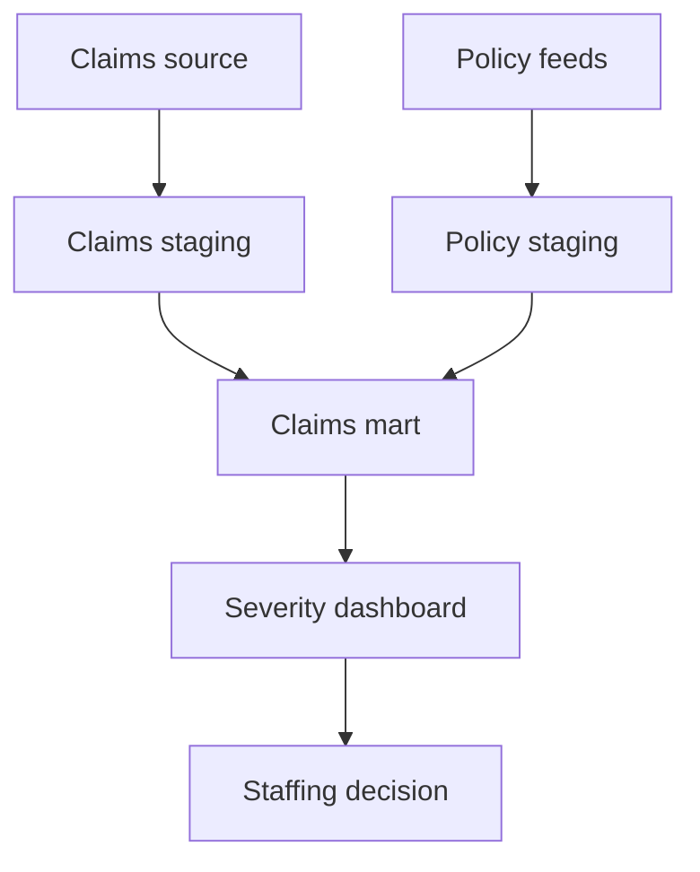

# Synthetic lineage graph

```mermaid
flowchart TD
    A["Claims source"] --> C["Claims staging"]
    B["Policy feeds"] --> D["Policy staging"]
    C --> E["Claims mart"]
    D --> E
    E --> F["Severity dashboard"]
    F --> G["Staffing decision"]
```
